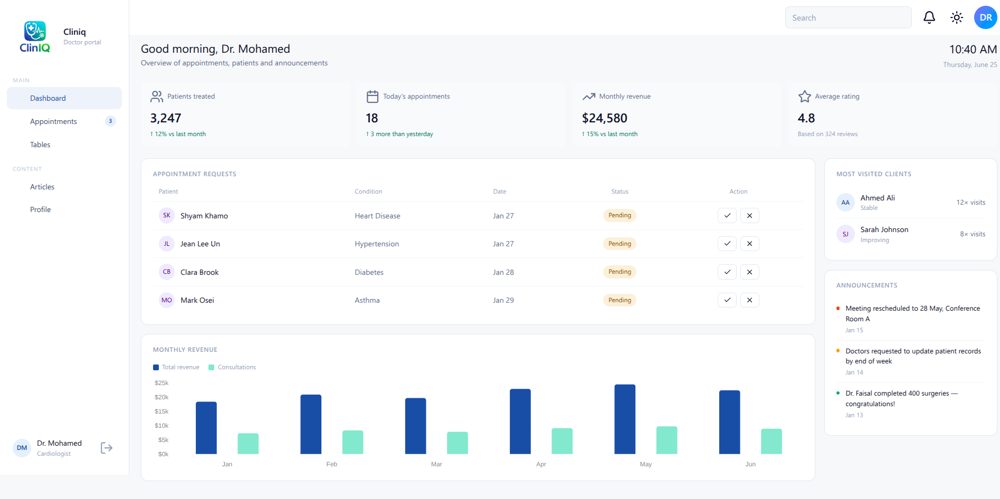
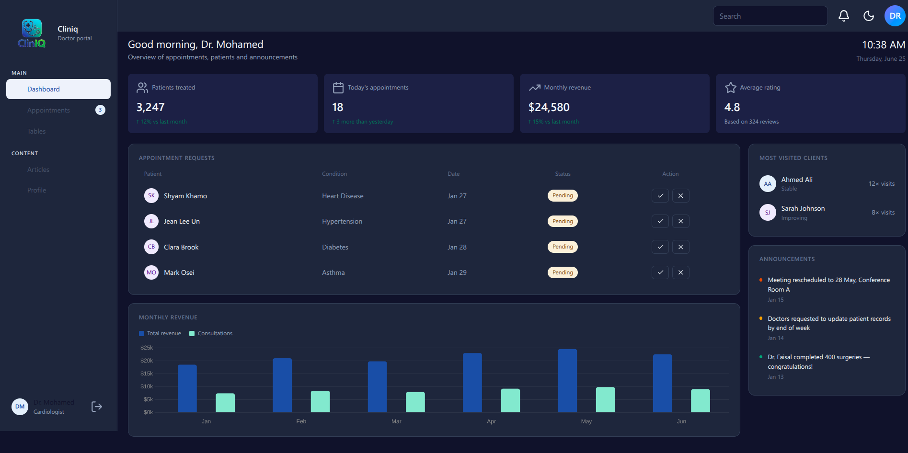
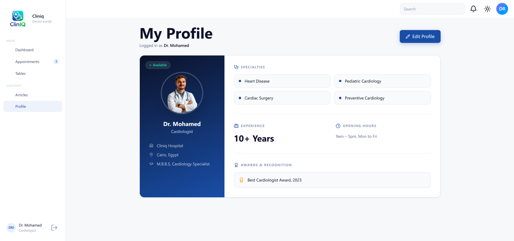
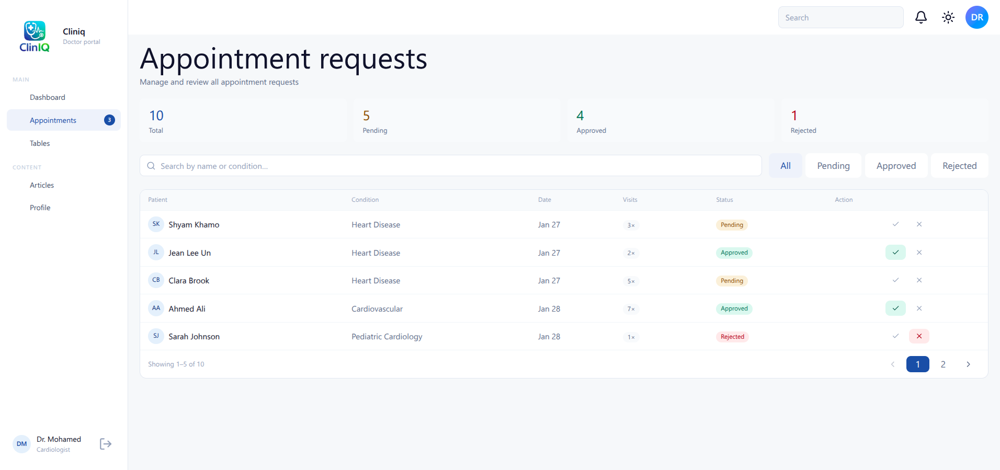

# ClinIQ — Doctor Dashboard

A modern clinic management frontend built with **React**, **Tailwind CSS v4**, and **Framer Motion**.



---

## ✨ Features

- 🏥 Doctor dashboard with appointments, revenue chart & patient stats
- 📅 Appointment management (approve / reject / filter / paginate)
- 👤 Doctor profile page with inline editing
- 🌙 Light / Dark mode toggle
- 📱 Fully responsive layout

---

## 🖼️ Screenshots

| Light Mode                                  | Dark Mode                                 |
| ------------------------------------------- | ----------------------------------------- |
|  |  |

| Profile Page                                | Appointments Page                                    |
| ------------------------------------------- | ---------------------------------------------------- |
|  |  |

---

## 🛠️ Tech Stack

| Layer      | Technology                   |
| ---------- | ---------------------------- |
| Framework  | React 18                     |
| Styling    | Tailwind CSS v4 + Custom CSS |
| Icons      | Lucide React                 |
| Routing    | React Router v6              |
| Charts     | Chart.js                     |
| Animations | Framer Motion                |

---

## 🚀 Getting Started

### Prerequisites

- Node.js `>= 18`
- npm or yarn

### Installation

```bash
# 1. Clone the repo
git clone https://github.com/ClinIQ-MedAI/cliniq-frontend.git
cd cliniq-frontend

# 2. Install dependencies
npm install

# 3. Start the dev server
npm run dev
```

Open [http://localhost:5173](http://localhost:5173) in your browser.

### Build for Production

```bash
npm run build
npm run preview
```

---

## 📁 Project Structure

```
src/
├── components/
│   ├── Dashboard/        # Main dashboard page
│   ├── Sidebar/          # Navigation sidebar
│   ├── Header/           # Top header bar
│   ├── Profile/          # Doctor profile page
│   └── Appointments/     # Appointments management
├── contexts/
│   ├── UserContext.jsx   # Logged-in user state
│   └── ThemeContext.jsx  # Dark / light mode
├── Services/
│   └── mockData.js       # Mock patients data
└── index.css             # Global styles + theme tokens
```

---

## 🌙 Theme System

Themes are driven by CSS variables. To switch between light and dark mode, the app sets `data-theme="dark"` on `<html>`.

Tokens are defined in `index.css`:

```css
:root {
    --bg-page: #f6f8fa;
    --bg-card: #ffffff;
    --text-1: #0f172a;
}

[data-theme="dark"] {
    --bg-page: #0f172a;
    --bg-card: #1e293b;
    --text-1: #f1f5f9;
}
```

---

## 👥 Contributing

Pull requests are welcome. For major changes, please open an issue first.

---

## 📄 License

[MIT](./LICENSE)
